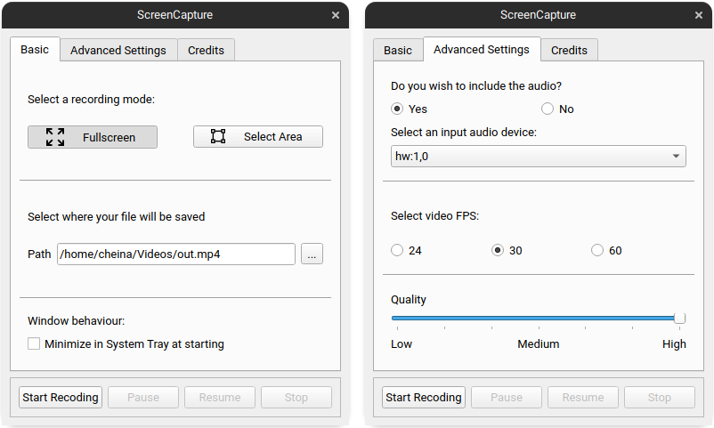
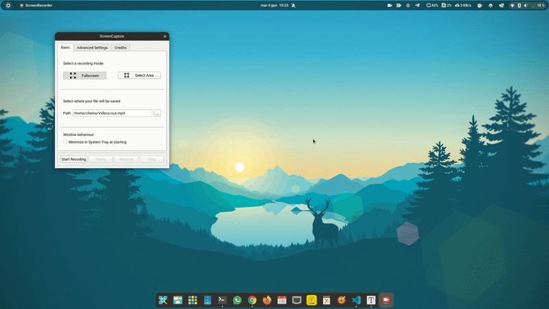

# Screen Recorder QT
Project for the **PDS** course at the **"Politecnico di Torino"**

### Group

- [Francesco Cheinasso](https://github.com/cheina97)
- [Alessandra Comparetto](https://github.com/alessandracomparetto)
- [Alessandro Cannarella](https://github.com/cannarelladev)

## About Project

**Screen Recorder QT** is a software based on two components. 

- The first is the **ScreenRecorder library**, a multiplatform **C++** library which allow to record the screen and optionally mux the audio recorded by the microphone with the captured video.
- The second is the **QT application**, a **C++ native** frontend based on **QT libraries**, used to interact with the **ScreenRecorder library**.

### Screen Recorder Library

This is the **core** of the project. The library is composed by 2 main files **ScreenRecorder.ccp** and **ScreenRecorder.h**. It uses **ffmpeg** libraries to capture the frames (video and audio) , to elaborate them, and to save in a **.mp4** file. Those libraries are **avcodec**, **avdevice**, **avfilter**, **avformat** and **avutil**.

It uses **2 threads** for the **video** recording and an for the **audio**:

- **Video**: 
    - **Raw Packets Thread**: It get the raw  video frames from the **os** virtual device (**x11grab** on Linux, **gdigrab** on Windows and  **avFoundation** on macOS) and insert them in a queue.
    - **Elaboration Thread**: This take the raw packets from the queue and **decode and encode** it in the new format and **write** them in the output file. It also perform **scaling**.
- **Audio**:
	- **Microphone capture thread**: It get the raw audio frames from an **os** virtual device (**alsa** on Linux, **dshow** on Windows and  **avFoundation** on macOS) save them in a queue creating **bursts** that are then **elaborated (decode and encode)** and **written** in the output file.

Those are the features offered by the library:

- Record **Screen Video** without  **microphone audio**
- Record **Screen Video** with **microphone audio**
- **Pause** and **Resume** recording without creating separated files. 
- **Compress** the video by a value chosen by the user *( 0 disable compression )*
- **Rescale** the video by a value chosen by the user, between 0.1 and 1 *( 1 means no rescaling, 0.5 half rescaling ).*
- Allows the user to specify the **position and the size** of the portion of screen that have to be recorded, by a value chosen by the user.
- Allows the user to specify the **screen number**.
- Allows the user to specify the screen recording's **fps**, by a value chosen by the user.
- Allows the user to specify an **audio input device** *(the library doesn't find the available devices, it is up to the application )*.
- Allows the user to specify the **output file name** (*it must end with **.mp4*** )
- In case of **internal errors** throws an **exception** with a **description of the error** and gracefully **stop the registration** (if the library is recording), creating the output file with what has been recorded till that moment.

### QT Application

Allow to use the **ScreenRecorder library**, offering a **GUI** to set the **parameters** and to give **commands**.

In order to improve the user experience, the **GUI** create also an icon in the os **system tray** to interact with the library without using the main window.

It uses **QTmultimedia** library to find the available **audio devices** on **Windows** and **MacOS**. Instead on **Linux** is used the **getAudioDevices** function ( in getAudioDevices.cpp ), which return only the **input audio devices**.

The dimensions of the screen are retrieved with **QGuiApplication** and a portion of the screen can be selected using the **AreaSelector** ( AreaSelector.cpp ).

#### Screenshots

### Legacy Applications
**ScreenRecorder library** can be used without the support of the GUI mentioned before. In the "legacy" versions, the user is able to record a video using the terminal window provided by the OS. 

In this case, it's possible to control the action of the application by pressing the commands
 - [1] to pause
 - [2] to resume
 - [3] to stop

While the folder **ScreenRecorderLegacyQT** holds the code to build this application using **Qmake** (through `ScreenRecorderLegacyQT.pro`), **ScreenRecorderLegacy** code can be compiled using **VisualStudio** of your preference.

## Linux

### How to run (QT application only)

- Download the latest binary from this [link](https://github.com/cheina97/PDS_Project/releases/latest/download/ScreenRecorder_linux_amd64)
- Install the required libraries with `sudo apt install ffmpeg qt5-default` (Needs QT 5.15 or higher versions)
- Allow the binary execution with `chmod 777 ScreenRecorder_linux_amd64`
- Run the program with `./ScreenRecorder_linux_amd64`

### How to compile and install

#### QT application

- Download the required **Qt libraries** `sudo apt install qt5-qmake qtmultimedia5-dev `
- Download the other required libraries `sudo apt install libasound2-dev libavcodec-dev libavdevice-dev libavfilter-dev libavformat-dev libavutil-dev`
- Install **c++ 20** `sudo apt install gcc-10 gcc-10-base gcc-10-doc g++-10` `sudo apt install libstdc++-10-dev libstdc++-10-doc`
- Clone the repository `git clone https://github.com/cheina97/ScreenRecorderQT.git`
- Go in the project folder  `cd ScreenRecorderQT/ScreenRecorderQT/ScreenRecorder`
- Generate the **Makefile** `qmake ScreenRecorder.pro`
- Compile it `make clean; make all`
- Allow the **binary** to be executed  `chmod 777 ScreenRecorder`
- Run it `./ScreenRecorder`
- (Optional) Install the **binary** and the  **desktop launcher** in your system `sudo make install`. You can revert this operation with `sudo make uninstall`. The **binary** will be installed in **/opt/ScreenRecorder/ScreenRecorder** and the **desktop launcher** in **/usr/share/applications/ScreenRecorder**.

In some cases installing **c++ 20** won't be enough to compile the application and the libraries. You will have to add manually **-std=gnu++2a** in the **CXXFLAGS** of the **Makefile ** generated by the **qmake** command.

#### Legacy application

- Download the required libraries `sudo apt install libasound2-dev libavcodec-dev libavdevice-dev libavfilter-dev libavformat-dev libavutil-dev`
- Install **c++ 20** `sudo apt install gcc-10 gcc-10-base gcc-10-doc g++-10` `sudo apt install libstdc++-10-dev libstdc++-10-doc`
- Clone the repository `git clone https://github.com/cheina97/ScreenRecorderQT.git`
- Go in the project folder  `cd ScreenRecorderQT/ScreenRecorderLegacy`
- Compile it `make clean-linux; make compile-linux`
- Allow the **binary** to be executed  `chmod 777 ScreenRecorder`
- Run it `./main`

#### Legacy application (Qmake)

- Download the required libraries `sudo apt install libasound2-dev libavcodec-dev libavdevice-dev libavfilter-dev libavformat-dev libavutil-dev`
- Install **c++ 20** `sudo apt install gcc-10 gcc-10-base gcc-10-doc g++-10` `sudo apt install libstdc++-10-dev libstdc++-10-doc`
- Clone the repository `git clone https://github.com/cheina97/ScreenRecorderQT.git`
- Go in the project folder  `cd ScreenRecorderQT/ScreenRecorderLegacyQT`
- Generate the **Makefile** `qmake ScreenRecorderLegacyQT.pro`
- Compile it `make clean; make all`
- Allow the **binary** to be executed  `chmod 777 ScreenRecorder`
- Run it `./ScreenRecorderLegacyQT `

### Troubleshooting

If the application return an error related to the video device when you start the recording it could be caused by the **DISPLAY** environment variable. Try to  **export** a new **DISPLAY** variable with the command `export DISPLAY=:1`. Sometimes (especially in **VM**) the **DISPLAY** variable contains the screen number  and looks like **:1.0** but this library is expecting a **DISPLAY** variable which look like **:1** (only the **Xserver**) without **screen number**.

---
## Windows

### How to compile and run (QT legacy application) 
- Download **Qt 5.15** or higher version.
- Open with **Qt Creator** the file `ScreenRecorderLegacyQT.pro` that you can find in the folder `ScreenRecorderLegacyQT`.
- Let Qt choose the best kit configuration. The default version provided should work just fine, but in case you need to know what has been used:
    - Device type: Desktop
    - Compiler C++: MinGW (C++, x86 64bit in C:\TDM-GCC-64\bin)
    - Debugger: System GDB at C:\TDM-GCC\bin\gdb.exe
    - Qt version: Qt 5.15.2 (mingw81_64)
    - CMake Tool: CMake 3.19.2 (Qt)
- Once the project is open, please click on "Project" in the side bar.
- You will be able to see "Run" option on the left (Build & Run section). Click on this option.
- Explicit the command line arguments in the field. An example may be `700 700 0 0 0 30 1 5 1 "Microphone (Realtek High Definition Audio)" ../outFolder/out.mp4`.
- Check the "Run in terminal" option.
- Finally, run the application using the green button. You will see the terminal pop up.

### How to compile and run (QT application)
- Download **Qt 5.15** or higher version.
- Open with Qt Creator the file `ScreenRecorder.pro` that you can find in the folder `ScreenRecorderQT\ScreenRecorder`.
- Let Qt choose the best kit configuration. The default version provided should work just fine, but in case you need to know what has been used:
     - Device type: Desktop
    - Compiler C++: MinGW (C++, x86 64bit in C:\TDM-GCC-64\bin)
    - Debugger: System GDB at C:\TDM-GCC\bin\gdb.exe
    - Qt version: Qt 5.15.2 (mingw81_64)
    - CMake Tool: CMake 3.19.2 (Qt)
- Finally, run the application using the green button. You will see GUI pop up.
