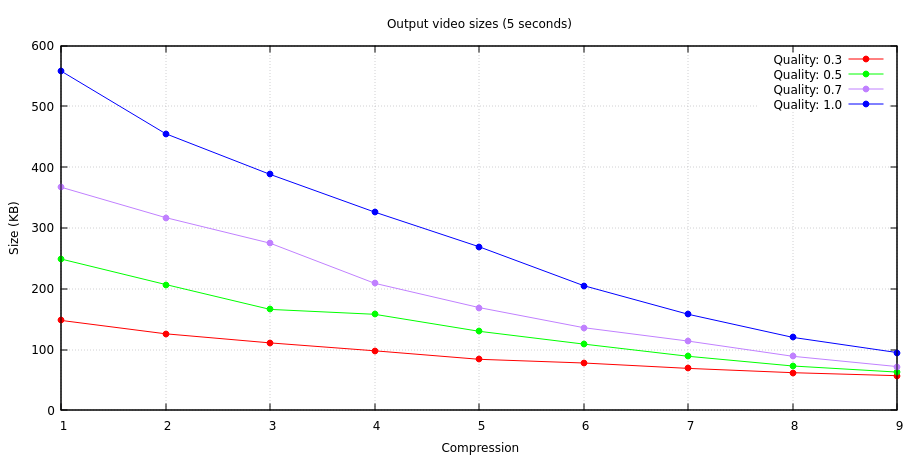

# Screen Recorder QT
Project for the PDS course at the "Politecnico di Torino"

### Group

- Francesco Cheinasso
- Alessandra Comparetto
- Alessandro Cannarella

## Description

This is a screen capture yadayadayada ......

## Linux

### How to run

- Download the latest binary from this [link](https://github.com/cheina97/PDS_Project/releases/latest/download/ScreenRecorder_linux_amd64)
- Install the required libraries with `sudo apt install ffmpeg qt5-default` (Needs QT 5.15 or higher versions)
- Allow the binary execution with `chmod 777 ScreenRecorder_linux_amd64`
- Run the program with `./ScreenRecorder_linux_amd64`

### How to compile

There a re 2 main methods to compile the project:

#### 1 - QtCreator (simpler but heavier)

- Download **QtCreator** and the required libraries `sudo apt install qtcreator qtmultimedia5-dev `
- Download the other required libraries `sudo apt install libasound2-dev libavcodec-dev libavdevice-dev libavfilter-dev libavformat-dev libavutil-dev` .
- Clone the repository `git clone https://github.com/cheina97/ScreenRecorderQT.git`
- Open the **.pro** file in **ScreenRecorderQT/ScreenRecorder** with **QtCreator**
- Click on the **Run** button to build the project and run it

#### 2 - Qmake (harder but lighter)

- Download the required **Qt libraries** `sudo apt install qt5-qmake qtmultimedia5-dev `
- Download the other required libraries `sudo apt install libasound2-dev libavcodec-dev libavdevice-dev libavfilter-dev libavformat-dev libavutil-dev`
- Clone the repository `git clone https://github.com/cheina97/ScreenRecorderQT.git`
- Go in the project folder  `cd ScreenRecorderQT/ScreenRecorder`
- Generate the makefile `qmake ScreenRecorder.pro`
- Compile it `make clean; make all`
- Allow the binary to be executed  `chmod 777 ScreenRecorder`
- Run it `./ScreenRecorder`
